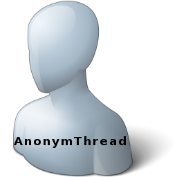

# AnonymThread
- Create anonymous thread with approch.                   
 

# Features  
- Execute code in an anonymous thread .
- Checking thread running before close

## Files

| File | Contents | 
| --- | --- |
| .gitignore | Git ignores the files in this file |
| About.pas | About view of the programme |
| Main.pas | Main view of the programme |
| AnonymThread.dpk | The compiler project file |
| AnonymThread.dproj | The MSBUILD project file |
| README.md | The readme for this project |
