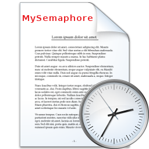

# MySemaphore
- Creates named Semaphore Object .                   
 

# Features  
- Creates Semaphore Object .
- Check User Parameters before adding using thread .

## Files

| File | Contents | 
| --- | --- |
| .gitignore | Git ignores the files in this file |
| About.pas | About view of the programme |
| Main.pas | Main view of the programme |
| Cheeck.pas | Cheeck view of the programme |
| DataModule.pas | Module of the programme |
| MySemaphore.dpk | The compiler project file |
| MySemaphore.dproj | The MSBUILD project file |
| README.md | The readme for this project |
