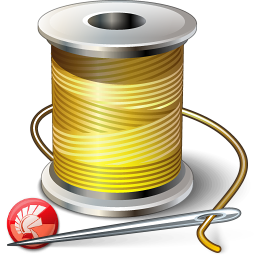

# Delphi-Collection-Thread
My Own Delphi-Collection ( Thread ) 

**Authors:**  *WalWalWalides*
------

## Contains

| File | Contents | 
| --- | --- |
| .gitignore | Git ignores the files in this file |
|[MySafeThread](https://github.com/walwalwalides/Delphi-Collection-Thread/tree/master/MySafeThread)|Create and Define Your Own Thread| 
|[HandshakeThread](https://github.com/walwalwalides/Delphi-Collection-Thread/tree/master/HandshakeThread)|Creating and Using WIN32 Events Objects Combined With a Single Thread|
| README.md | The readme for this project|
